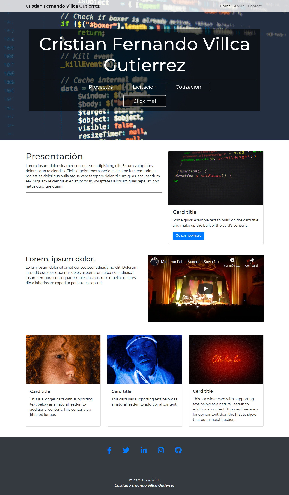

# Bootstrap theme 2 (posible formato de portafilio futuro)

Pagina web estatica resposnive con HTML, CSS y bootstrap 

## **Dependencias**
* Scroll Reveal 
    https://unpkg.com/scrollreveal

* Font awesome
    https://cdnjs.cloudflare.com/ajax/libs/font-awesome/5.13.0/css/all.min.css

* Google Fonts
    https://fonts.googleapis.com/css2?family=Montserrat:ital,wght@0,400;0,500;0,600;1,400;1,600&display=swap

* Boostrap 4